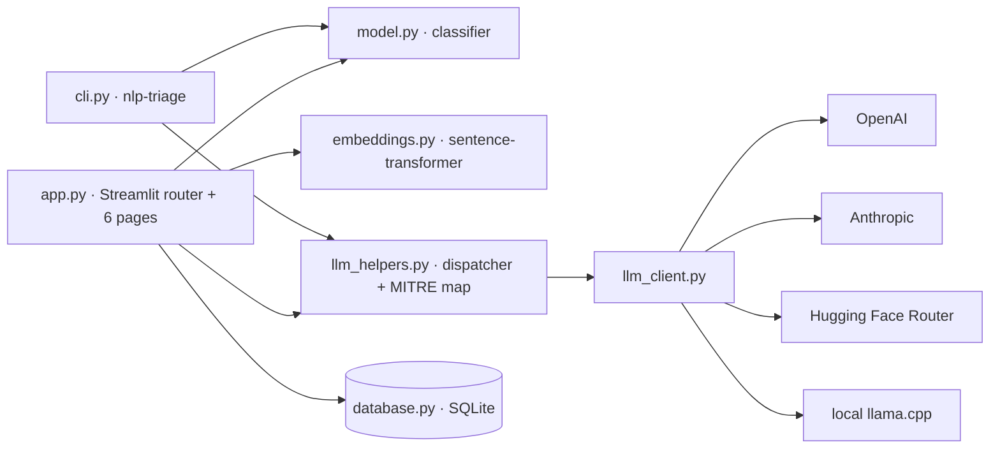

<div align="center">


# AlertSage

### Open-source SOC console — free-text incident in, MITRE ATT&CK triage card out.

Hybrid TF-IDF + sentence-transformer classifier · multi-provider LLM dispatcher · IOC enrichment · batch processing · case management.

[](https://www.python.org/downloads/release/python-3120/)
[](https://streamlit.io/)
[](LICENSE)
[](https://github.com/texasbe2trill/AlertSage/actions/workflows/tests.yml)
[](https://alertsage.streamlit.app/)

**Live demo:** [alertsage.streamlit.app](https://alertsage.streamlit.app/)

<br />


</div>

---

## What it is

AlertSage is an open-source SOC console. Paste a free-text security incident; get back a MITRE ATT&CK-mapped triage card with severity, kill chain, IOCs, and an analyst-ready rationale in about 30 seconds.

```
free text  ->  hybrid classifier  ->  LLM second opinion  ->  triage card
              ~1.4s                   ~5s                     instant
```

- **Hybrid classifier** — TF-IDF + sentence-transformer first pass (~1.4s); an LLM commits the verdict and writes the rationale
- **Multi-provider LLM dispatcher** — OpenAI, Anthropic, Hugging Face Inference Router, or local `llama.cpp`; falls back through the chain when a key is missing, with per-provider rate limiting
- **IOC enrichment** — auto-extracted indicators with VirusTotal / AbuseIPDB / Shodan / GreyNoise pivots
- **Batch processing** — CSV up to 500 rows, per-row triage plus tactic-level MITRE coverage and executive rollup exports
- **Case management** — SQLite-backed history, bookmarks, analyst notes, a four-stage case workflow (New / Triaging / Contained / Closed), and per-case timelines
- **BYOK, no leaks** — API keys live in `st.session_state` only; never written to disk, never logged, never echoed in error messages

---

## Quick start

```bash
git clone https://github.com/texasbe2trill/AlertSage.git
cd AlertSage
python3.12 -m venv .venv && source .venv/bin/activate
pip install -r requirements.txt
streamlit run app.py
```

Open http://localhost:8501. Drop a provider key into your shell (any one works):

```bash
export ANTHROPIC_API_KEY=sk-ant-...
# or:  export OPENAI_API_KEY=sk-...
# or:  export HF_TOKEN=hf_...
```

For the test suite, headless triage CLI, and optional `llama-cpp-python` for local GGUF inference:

```bash
pip install -r requirements-dev.txt
pytest tests/ -v
```

---

## Bring your own key

The dispatcher tries the explicit provider first, falls back through the chain when a key is missing, and surfaces the active backend in the sidebar.

| Provider | Default model | Cost | Latency |
|---|---|---|---|
| **Anthropic** | `claude-haiku-4-5` | comparable to OpenAI, sharper rationale | sub-second |
| **OpenAI** | `gpt-4o-mini` | ~$0.15 per 1M input tokens | sub-second |
| **Hugging Face Router** | `meta-llama/Llama-3.1-8B-Instruct:cerebras` | free tier covers demos | 1-2s |
| **Local llama.cpp** | drop a `.gguf` into `models/` | free | hardware-dependent |

Per-provider sliding-window rate limiting (5 requests / 60s default per session) keeps one provider's quota from blocking the others.

---

## The six pages

### Overview · mission control

KPI tiles, a 30-day brushable timechart, classifier confidence histogram, severity donut, MITRE ATT&CK heatmap, and a live tail polling SQLite.

### Investigate


Paste a narrative, hit **Triage**. The result card unfolds: severity pill, classifier and LLM timing, four-stage case stepper, kill chain across all 13 ATT&CK enterprise tactics, auto-extracted IOCs with VirusTotal / AbuseIPDB / Shodan / GreyNoise pivots, top-N class probabilities, the LLM rationale, and a SOC playbook hint.

### Hunt


Free-text query, multiselect filters, confidence + anomaly sliders, time window. Per-row **View** opens the analysis in Investigate; per-row **Bookmark** saves it. Save a filter set as a named search and it pins to the sidebar.

### Batch


CSV upload (auto-detects `incident_text` / `description` / `narrative` / `alert` / `text` columns) up to 500 rows. Returns label distribution, tactic-level MITRE coverage, and three CSV exports (per-row results, technique coverage, executive tactic rollup).

### Bookmarks


Saved investigations as expander cards. Severity pill, case status pill, narrative quote, the New / Triaging / Contained / Closed stepper, analyst notes, and full case timeline.

### Settings


Provider radio. Password-masked BYOK fields. Demo data generator. Triage threshold sliders. Local provider hides itself when `llama-cpp-python` and a `.gguf` aren't on the host.

---

## Architecture



`app.py` is a thin Streamlit router. The brains live in `src/triage/`:

- `model.py` + `embeddings.py` + `preprocess.py` · TF-IDF + sentence-transformer feature pipeline, Logistic Regression classifier
- `llm_helpers.py` · provider-agnostic dispatcher, MITRE technique map, fallback chain, IOC extraction
- `llm_client.py` · minimal SDK wrappers for OpenAI, Anthropic, Hugging Face Router, llama.cpp
- `database.py` · SQLite schema for analysis history, bookmarks, notes, case status, timelines

Heavy loaders cache via `@st.cache_resource` so they load once per process. The same helpers back a `nlp-triage` CLI for headless / scripted triage.

---

## CLI

```bash
nlp-triage "Multiple users reported a phishing email impersonating IT support."
```

Produces a JSON triage record (label, MITRE techniques, rationale, IOCs) on stdout. Useful for piping into SOAR playbooks or batch jobs that don't need the Streamlit UI.

---

## Configuration

Most behavior is controlled through environment variables or `.streamlit/secrets.toml`. The app discovers tokens in this order: session state (BYOK fields) → secrets file → environment variables.

| Variable | Purpose |
|---|---|
| `ANTHROPIC_API_KEY` | Anthropic Messages API |
| `OPENAI_API_KEY` | OpenAI Chat Completions |
| `HF_TOKEN` | Hugging Face Inference Router |
| `HF_MODEL` | Override the default HF model id |
| `IS_HOSTED_DEMO` | Set to `1` to auto-seed 30 days of synthetic incidents on first cold start |
| `VIRUSTOTAL_API_KEY` | Optional, enables real IOC enrichment |

---

## Deploy gotchas

<details>
<summary><strong>Streamlit Cloud picks up the latest Streamlit if you don't pin</strong></summary>

This repo pins `streamlit>=1.39,<1.40`. Newer versions changed sidebar internals and fragment scheduling enough to break our auto-mounted refresh fragments during cold start. Don't unpin without an end-to-end deploy test.

</details>

<details>
<summary><strong>Cascading <code>ModuleNotFoundError: torchvision</code></strong></summary>

Streamlit's file watcher introspects loaded modules, and transformers 5.x lazy-imports image processors that need torchvision. We don't ship torchvision because we only use text embeddings. Fixed by `.streamlit/config.toml` (`fileWatcherType = "none"`) and pinning `transformers<5`.

</details>

<details>
<summary><strong>WebSocket disconnects under load on Overview</strong></summary>

Six auto-refreshing fragments share a 4-second cached SQLite snapshot. Drop the cache TTL too far and the WS heartbeat times out. If you add fragments, share the snapshot.

</details>

---

## Roadmap

- TAXII / MISP threat intel ingest (currently a static curated feed)
- Analyst corrections fed back as labeled training data
- Saved-search pinning on Overview
- STIX 2.1 / MISP export from Batch

---

## Contributing

Issues and pull requests welcome.

- `pytest tests/` must stay green
- Runtime dependencies in `requirements.txt`, dev tooling in `requirements-dev.txt`
- `main` is always deployable; open an issue before larger changes

---

## License

[Apache License 2.0](LICENSE).

Built with [Streamlit](https://streamlit.io/), [scikit-learn](https://scikit-learn.org/), [sentence-transformers](https://sbert.net/) (`all-MiniLM-L6-v2`), [llama.cpp](https://github.com/ggerganov/llama.cpp), the [OpenAI](https://github.com/openai/openai-python) and [Anthropic](https://github.com/anthropics/anthropic-sdk-python) SDKs, the [Hugging Face Inference Router](https://huggingface.co/docs/api-inference/index), and [Plotly](https://plotly.com/python/).

MITRE ATT&CK used under MITRE's [terms of use](https://attack.mitre.org/resources/terms-of-use/). Full attribution: [docs/mitre-attribution.md](docs/mitre-attribution.md).

UI inspired by Splunk Enterprise Security and Elastic Security; AlertSage is not affiliated with either.
