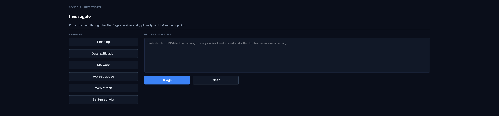
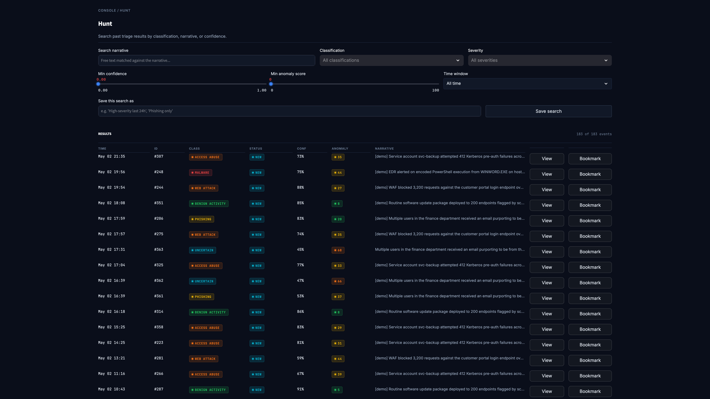
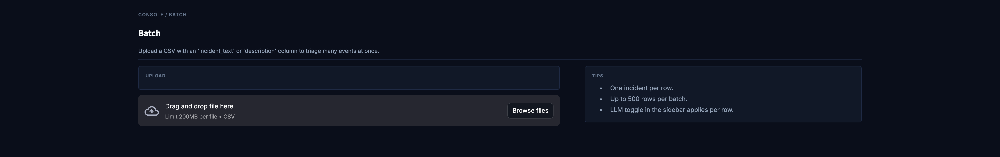
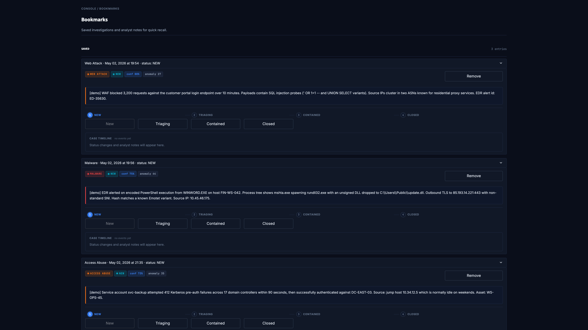
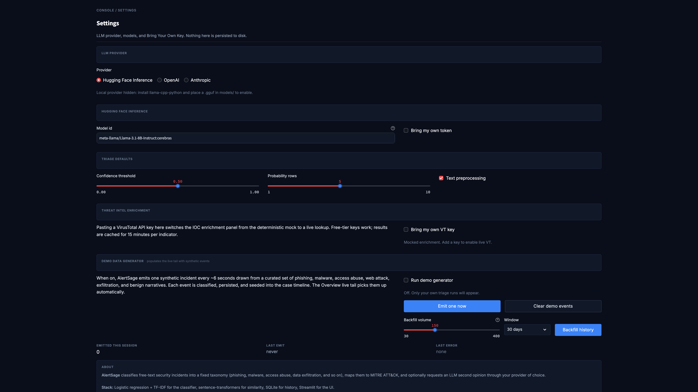
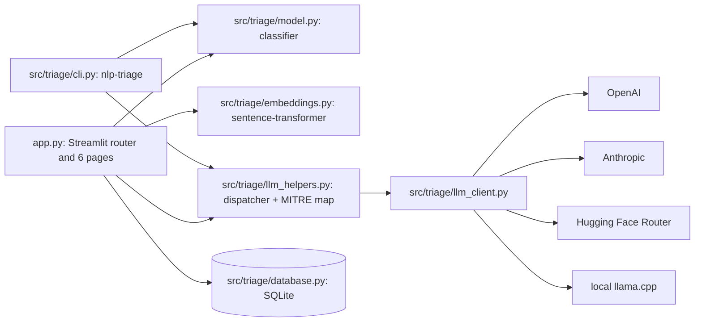

<div align="center">


# AlertSage

### Intelligent security triage, in the time it takes to read the alert.

<br />

[](https://www.python.org/downloads/release/python-3120/)
[](https://streamlit.io/)
[](LICENSE)
[](https://github.com/texasbe2trill/AlertSage/actions/workflows/tests.yml)
[](https://alertsage.streamlit.app/)

</div>

<br />

<div align="center">

### Try the live demo

**[alertsage.streamlit.app](https://alertsage.streamlit.app/)**

A populated SOC console with synthetic events, a working classifier, and the LLM second-opinion dispatcher (Hugging Face by default; bring your own key for OpenAI or Anthropic).

<br />


<br /><br />


</div>

---

## Why AlertSage

Security operations centers spend an outsized fraction of every shift on the same fifteen minutes: read the alert, decide a label, map it to MITRE ATT&CK, write a rationale, paste actions into the ticket. Most of that work is mechanical recall against a fixed taxonomy. The bottleneck is not the analysis, it is the typing.

AlertSage compresses that fifteen minutes into about thirty seconds. Free-text incidents land on a SIEM-style dashboard, get classified by a TF-IDF plus sentence-transformer hybrid, optionally routed through an LLM for a written rationale, and surfaced with MITRE ATT&CK kill chain context, IOC enrichment, and a SOC playbook hint. Bring your own key for the LLM provider you trust, or run fully local with `llama.cpp`. Keys live in session state only, never on disk.

The console is modeled on production tools (Splunk Enterprise Security, Elastic Security): dark mode by default, severity as the primary color signal, JetBrains Mono for IDs and timestamps. It is open source, runs locally in one command, and is deliberately built to be *demo-able*: the empty state on a fresh deploy auto-seeds synthetic history so the dashboard looks lived in from the first visit.

---

## What's inside

The sidebar has six pages. Each maps to a different SOC workflow.

### Overview


Mission control. Six KPI tiles (total analyzed, critical and high count, last 24 hours, average classifier confidence, bookmarks, analyst notes), a 30-day stacked-bar timechart with a brushable Splunk-style range slider, a classifier-confidence histogram, a severity donut, a MITRE ATT&CK heatmap, and a live-tail panel that polls SQLite every few seconds. Every panel auto-refreshes through `st.fragment(run_every=...)` so the page feels alive without a manual reload.

### Investigate



The headline showcase surface. Pick an example narrative or paste one in, hit triage, and the result card unfolds: severity pill, mono event ID, classifier and LLM timing, four-stage case status stepper, MITRE ATT&CK kill chain visualization across all 13 enterprise tactics, an indicators panel with auto-extracted IOCs and external pivot links (VirusTotal, AbuseIPDB, Shodan, GreyNoise, MITRE CVE), the case timeline, top-N class probabilities, the LLM rationale, and a SOC playbook hint with checkbox-style actions.

### Hunt



Full-text search across triage history. Filters: free-text query, classification multiselect, severity multiselect, minimum confidence slider, minimum anomaly score slider, time-window selector. Save the current filter set as a named search and it appears in the sidebar as a one-click apply.

### Batch



CSV upload (auto-detects `incident_text`, `description`, `narrative`, `alert`, or `text` columns) for up to 500 rows per run. After processing: a KPI strip, a label distribution panel, a tactic-level MITRE coverage report, and three CSV exports (per-row triage results, MITRE coverage by technique, executive tactic rollup).

### Bookmarks



Saved investigations as expander cards. Each carries the severity pill, the current case status pill, the narrative quote (severity-toned), the four-button case status stepper (New, Triaging, Contained, Closed), the optional analyst note, and the full case timeline.

### Settings



Provider radio plus per-provider configuration panels for OpenAI, Anthropic, Hugging Face, and (when available locally) GGUF llama.cpp. Password-masked Bring Your Own Key fields. A demo data generator panel with a manual emit, a counter, the last error, and a "backfill 30 days of synthetic events" button. Triage default sliders. The Local provider is automatically hidden when the host has no llama-cpp-python or no `.gguf` file in `models/`.

---

## Bring your own key

AlertSage routes the optional LLM second opinion through whichever provider you select. **Keys live in `st.session_state` only. They are never written to `data/triage.db`, never logged, and never echoed in error messages.**

| Provider | Default model | Where to get a key | Cost posture | Latency posture |
|---|---|---|---|---|
| **OpenAI** | `gpt-4o-mini` | [platform.openai.com/api-keys](https://platform.openai.com/api-keys) | Cheapest hosted option for this workload (about $0.15 per 1M input tokens at time of writing). | Sub-second median. |
| **Anthropic** | `claude-haiku-4-5` | [console.anthropic.com](https://console.anthropic.com/settings/keys) | Comparable to OpenAI for short prompts. Stronger rationale quality. | Sub-second median. |
| **Hugging Face Inference Router** | `meta-llama/Llama-3.1-8B-Instruct:cerebras` | [huggingface.co/settings/tokens](https://huggingface.co/settings/tokens) | Free tier covers low-volume demos. Cerebras provider is fast. | About 1 to 2 seconds. |
| **Local llama.cpp (GGUF)** | local `.gguf` file | Download a Llama 3.1 8B Q6_K (or similar) to `models/` | Free. GPU recommended. | Varies with model and hardware (single-digit seconds on Apple Silicon Metal, faster on CUDA). |

The dispatcher implements a graceful fallback chain: if you pick OpenAI or Anthropic but the key is missing, it routes to Hugging Face when an HF token is present, and finally to local `llama.cpp` if a GGUF is on disk. The sidebar caption shows the actually-active backend after fallbacks resolve.

Per-provider sliding-window rate limits keep one provider's quota from blocking the others (default: 5 requests per 60 seconds per provider per session).

---

## Quick start

Targets Python 3.12 (pinned via `runtime.txt`).

```bash
# 1. Clone
git clone https://github.com/texasbe2trill/AlertSage.git
cd AlertSage

# 2. Install (runtime only)
python3.12 -m venv .venv
source .venv/bin/activate
pip install -r requirements.txt

# 3. Run
streamlit run app.py
```

Open http://localhost:8501. The Hugging Face provider works out of the box if you set an `HF_TOKEN` env var or drop one into `.streamlit/secrets.toml`:

```toml
HF_TOKEN = "hf_..."
HF_MODEL = "meta-llama/Llama-3.1-8B-Instruct:cerebras"
```

For tests, notebooks, and the optional `llama-cpp-python` for local GGUF inference, install the dev extras:

```bash
pip install -r requirements-dev.txt
pip install -e ".[dev]"
pytest tests/ -v
```

<details>
<summary>Common deploy issues</summary>

- **Cascading `ModuleNotFoundError: No module named 'torchvision'` in deploy logs.** Streamlit's file watcher introspects loaded modules, and recent transformers versions lazy-import 80+ image processors that need torchvision. Fixed in this repo by `.streamlit/config.toml` (`fileWatcherType = "none"`) and pinning `transformers<5`. If you fork and bump versions, watch for the cascade returning.
- **"Streamlit Cloud subdomain stuck after delete."** The platform holds a deleted app's subdomain in cooldown for up to a few hours. Wait or pick a different subdomain.
- **"connection error" / WebSocket disconnects under load.** The Overview page mounts six auto-refreshing fragments. They share a 4-second cached history snapshot to avoid hammering SQLite. If you reduce the cache TTL or add more fragments, the WS heartbeat can time out.

</details>

---

## Architecture

`app.py` is a thin Streamlit router that mounts six pages and a single design system (`assets/styles.css`). Everything technical lives in `src/triage/`: a TF-IDF and sentence-transformer hybrid feature pipeline (`embeddings.py`, `model.py`, `preprocess.py`), a provider-agnostic LLM client layer (`llm_client.py` for the four backends, `llm_helpers.py` for the dispatcher and MITRE map), and a SQLite layer for history, bookmarks, notes, case status, and case timeline (`database.py`). The same helpers back the `nlp-triage` CLI in `cli.py`.



Heavy loaders (vectorizer, classifier, embedder, database) are wrapped in `@st.cache_resource` so they load once per process. The hot path on Investigate is roughly: free text into `predict()` (TF-IDF plus sentence-transformer, concatenated, into the trained Logistic Regression), then optionally into `llm_second_opinion()` (the dispatcher), then into `_persist_analysis()` (a SQLite insert plus a timeline seed).

---

## Project status

This is an active personal project being revived after a 5-month pause. The recent revival landed in a few clear waves:

1. A complete UI rewrite from a "premium" purple-gradient Streamlit app into a SOC console (dark, dense, severity-driven), modeled on Splunk Enterprise Security and Elastic Security.
2. Bring Your Own Key support for OpenAI, Anthropic, and Hugging Face, with capability-gated local `llama.cpp` and a graceful fallback chain.
3. A slim `requirements.txt` (down from a 136-line pip-freeze to 16 runtime deps), `runtime.txt` pinning Python 3.12, and a separate `requirements-dev.txt` for tests and notebooks.
4. Resource caching, a fix for a 384-dim feature mismatch in the classifier path, an auto-refreshing Overview, an auto-seeded demo for fresh deploys, and a `.streamlit/config.toml` that stops the file-watcher cascade.
5. A documented `nlp-triage` CLI plus a refreshed mkdocs site at `docs/`.

What's next, roughly in priority order:

1. Real screenshots and a 60-second walkthrough GIF (the placeholders in this README).
2. Flesh out the threat intel feed beyond the static demo entries (TAXII collection ingest).
3. Save analyst-tagged corrections back as labeled training data so the classifier improves over time.
4. Add a saved-search pin to the Overview rail so common Hunts are one click from mission control.
5. Optional STIX 2.1 / MISP export from Batch.

---

## Contributing

Issues and pull requests welcome. The test suite is small (`pytest tests/ -v`); please keep it green. Style: Apache 2.0 in the headers where present, no em-dashes in user-facing strings (commit messages, docs, UI copy), and keep the runtime `requirements.txt` lean (move dev tooling to `requirements-dev.txt`).

For larger changes, open an issue first so we can sanity-check direction. The repo follows a "main is the deployable branch" convention: every commit on main should boot the app cleanly.

---

## License and acknowledgements

Released under the [Apache License 2.0](LICENSE).

Built on the shoulders of: [Streamlit](https://streamlit.io/) for the app framework, [scikit-learn](https://scikit-learn.org/) for the classifier, [sentence-transformers](https://sbert.net/) and the `all-MiniLM-L6-v2` model for embeddings, [llama.cpp](https://github.com/ggerganov/llama.cpp) and [llama-cpp-python](https://github.com/abetlen/llama-cpp-python) for local inference, the [OpenAI](https://github.com/openai/openai-python) and [Anthropic](https://github.com/anthropics/anthropic-sdk-python) Python SDKs, the [Hugging Face Inference Router](https://huggingface.co/docs/api-inference/index) for hosted models, and [Plotly](https://plotly.com/python/) for charts.

The MITRE ATT&CK technique map is used under MITRE's [terms of use](https://attack.mitre.org/resources/terms-of-use/). See [docs/mitre-attribution.md](docs/mitre-attribution.md) for full attribution.

Logo and console design by the author. Inspiration drawn from Splunk Enterprise Security and Elastic Security; AlertSage is not affiliated with either.
