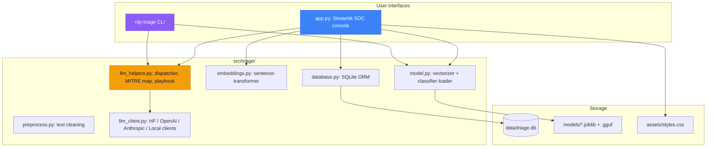
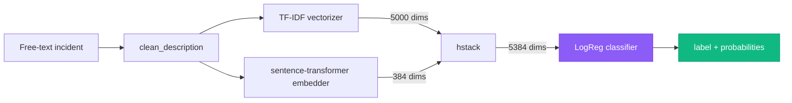
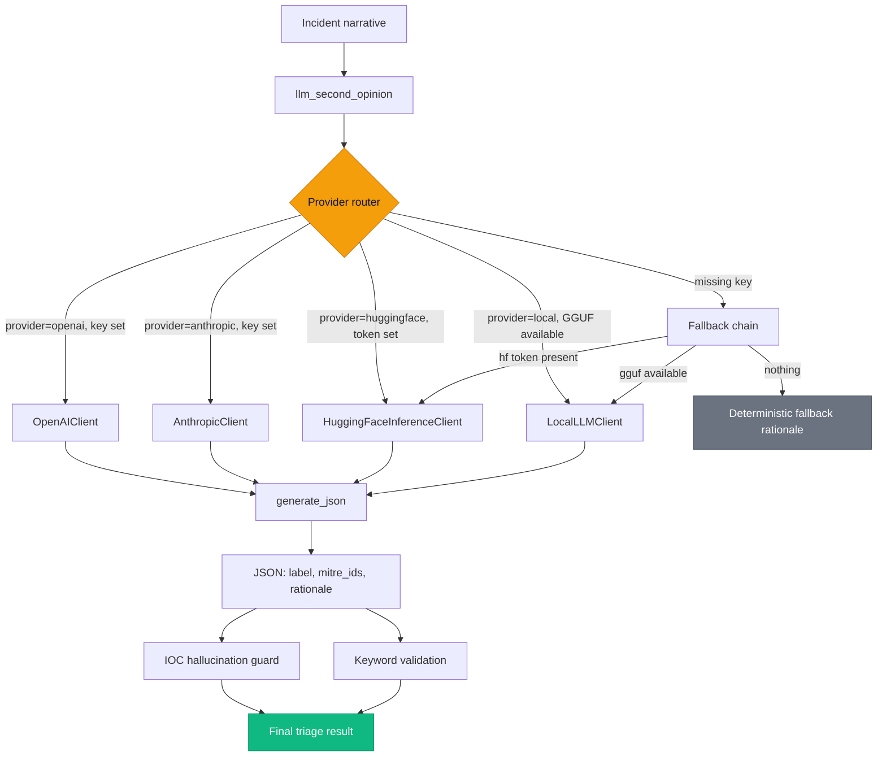
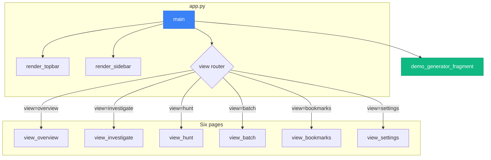
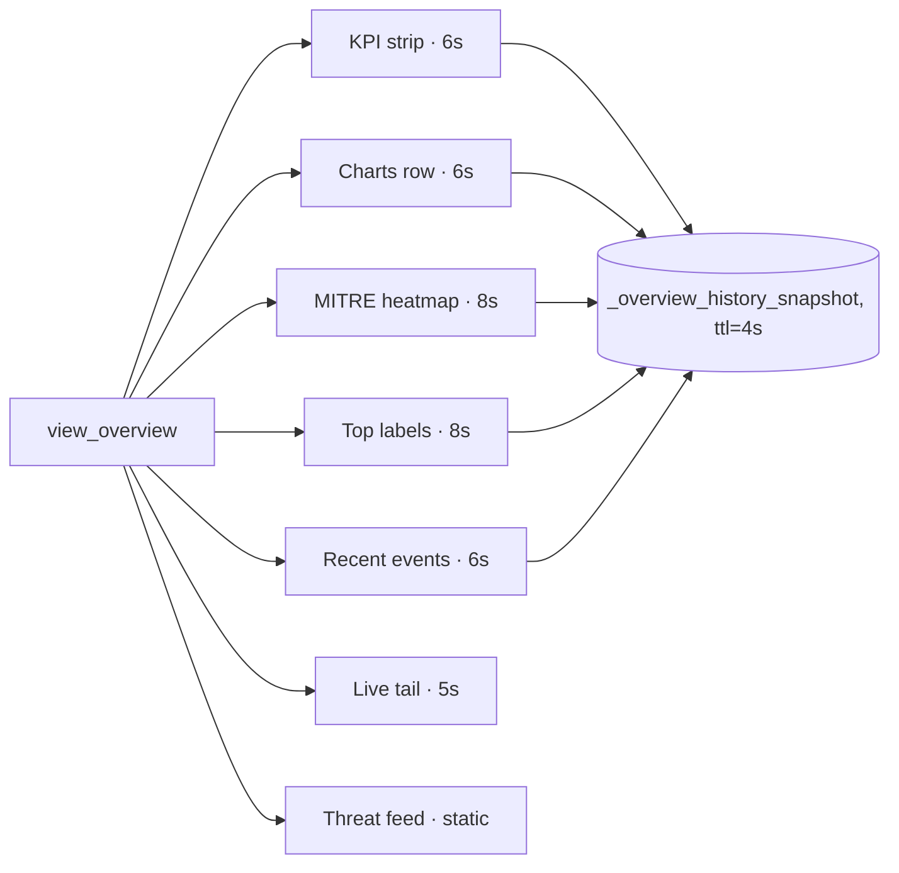
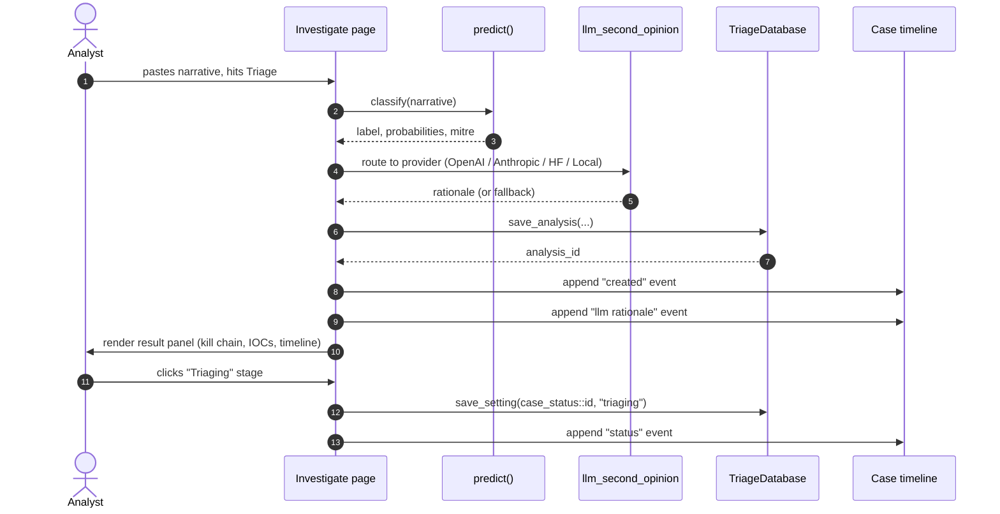

# Architecture

How the SOC console, the classifier, the LLM dispatcher, and the database fit together.

## High-level

The console (`app.py`) is the only Streamlit-aware module. Everything in `src/triage/` is pure Python with no Streamlit imports, so the CLI and notebooks can use the same helpers without dragging the UI along.

## Module map

| Module | Lines | Responsibility |
|---|---|---|
| `app.py` | ~3,500 | Streamlit router, six pages, design system loader, fragments, demo generator, IOC enrichment, kill chain rendering, case status workflow, saved searches |
| `assets/styles.css` | ~1,300 | Single-source design system. Tokens on `:root`, severity palette, all panel/chart styling |
| `src/triage/cli.py` | ~900 | `nlp-triage` CLI entry point with rich-formatted output, JSON mode, bulk processing, difficulty modes |
| `src/triage/llm_helpers.py` | ~700 | Provider-agnostic `llm_second_opinion()` dispatcher, MITRE technique mapping, SOC playbook hints, IOC hallucination guardrails |
| `src/triage/llm_client.py` | ~600 | `HuggingFaceInferenceClient`, `OpenAIClient`, `AnthropicClient`, `LocalLLMClient`. All implement `generate_json(prompt) -> dict` |
| `src/triage/database.py` | ~1,200 | SQLite schema and accessors: history, bookmarks, notes, profiles, settings (used for case status, case timeline, saved searches) |
| `src/triage/model.py` | ~60 | Loader for the TF-IDF vectorizer and the LogReg classifier |
| `src/triage/embeddings.py` | ~200 | `IncidentEmbeddings` wrapping a sentence-transformer model |
| `src/triage/preprocess.py` | ~50 | `clean_description()` text normalization shared by training and inference |

## Classifier pipeline

The console's `predict()` function in `app.py` builds the feature matrix by branching on the loaded model's `n_features_in_` attribute:

- `5000` features: TF-IDF only, use the baseline classifier (`baseline_logreg.joblib`).
- `5384` features: TF-IDF + sentence-transformer embeddings concatenated with `scipy.sparse.hstack`, use the enhanced classifier (`enhanced_logreg.joblib`).

This means the same code path supports both checkpoints transparently. The CLI uses a similar split via `predict_event_type()` in `model.py`.

## LLM second opinion

Each provider client implements the same `generate_json(prompt, max_tokens=...) -> dict` interface so the dispatcher in `llm_helpers.llm_second_opinion()` is provider-agnostic.

The fallback chain handles the BYOK case where the user picks a provider but does not paste a key: instead of failing, the call routes to whichever provider has working credentials. This is what lets the hosted demo work for first-time visitors without requiring them to set up an account.

After the LLM returns, two guardrails run:

1. **IOC hallucination guard**: extract IOCs from the original narrative and from the rationale. If the rationale invents IOCs that aren't in the source, downgrade label to `uncertain` and replace the rationale with the deterministic fallback.
2. **Keyword validation**: if the LLM returns `data_exfiltration` but the narrative contains no exfil keywords, downgrade. Same for malware, web_attack, access_abuse, policy_violation, phishing.

Both guardrails are conservative; "uncertain" is a feature, not a bug.

## SOC console structure

Six pages plus the always-mounted demo generator fragment. The demo generator is a top-level fragment so it fires regardless of which view is active; it self-checks the toggle and is a no-op when off.

### Auto-refreshing fragments on Overview

Six fragments share a 4-second cached history snapshot, so a refresh cycle hits SQLite at most once per cycle no matter how many fragments fire.

## Database schema

```mermaid
erDiagram
    analysis_history ||--o{ bookmarks : "has"
    analysis_history ||--o{ notes : "has"
    analysis_history ||--o{ tags : "has"
    settings {
        string key PK
        string value
    }
    profiles ||--o{ profile_settings : "has"

    analysis_history {
        int id PK
        string timestamp
        string incident_text
        string final_label
        float max_prob
        string uncertainty_level
        string analysis_mode
        string difficulty
        float threshold
        int use_llm
        json raw_result
        string batch_id
    }

    bookmarks {
        int id PK
        int analysis_id FK
        string note
        string timestamp
    }

    notes {
        int id PK
        int analysis_id FK
        string note_text
        string timestamp
    }
```

Case status, case timeline, and saved searches all piggyback on the `settings` key-value table:

- `case_status::{analysis_id}` -> `"new" | "triaging" | "contained" | "closed"`
- `case_timeline::{analysis_id}` -> JSON list of `{ts, kind, details, extra}` events
- `saved_searches` -> JSON list of `{name, saved_at, filters}`

This avoids schema migrations when adding new persistent UI state.

## Data flow: one triage end to end

## Performance characteristics

| Step | Typical latency |
|---|---|
| Streamlit cold start (after our slim) | 5-8 seconds |
| Classifier load (cache_resource, once per process) | 200 ms |
| Embedder load (cache_resource, once per process) | 1-2 seconds (first call only) |
| Single triage classify | 30-80 ms |
| LLM second opinion (Hugging Face router) | 800-2,500 ms |
| LLM second opinion (OpenAI gpt-4o-mini) | 400-1,200 ms |
| LLM second opinion (Anthropic Haiku) | 500-1,500 ms |
| LLM second opinion (Local Llama 3.1 8B Q6_K, M3 Max) | 1,500-3,000 ms |
| SQLite write per analysis | ~5 ms |
| Overview cached history snapshot fetch | ~10 ms |

The cold start improvement vs the prior build comes from removing the inline 700-line CSS, deferring the 1900-line CLI module import, gating the 789 MB metrics joblib on file existence, and wrapping heavy loaders in `@st.cache_resource`.

## Technology stack

| Layer | Choice |
|---|---|
| Web UI | Streamlit 1.39+ with custom CSS |
| Styling | Single external `assets/styles.css`, Material-style design tokens |
| Charting | Plotly (range slider, heatmap, donut, stacked bar, histogram) |
| ML training | scikit-learn (TF-IDF, Logistic Regression) |
| Embeddings | sentence-transformers (`all-MiniLM-L6-v2`) |
| Local LLM | llama-cpp-python (optional) |
| Hosted LLM | OpenAI, Anthropic, Hugging Face Router (BYOK) |
| Threat intel | VirusTotal (BYOK) |
| Storage | SQLite |
| Tests | pytest |
| Docs | MkDocs Material |

See [LLM integration](llm-integration.md) for provider details and [Model information](model-information.md) for the ML stack.
