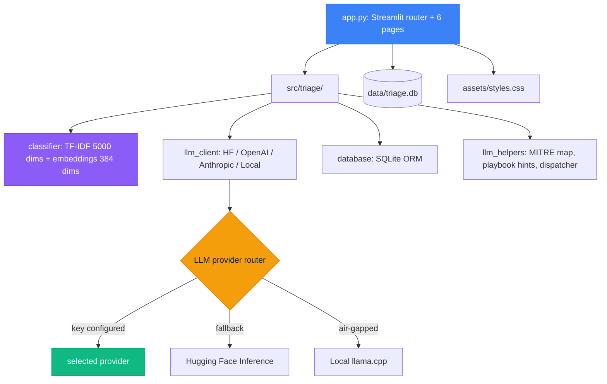

# AlertSage

A SOC-style incident triage console that classifies free-text security alerts, maps them to MITRE ATT&CK, and routes them through your LLM of choice. Open-source, dark-mode-first, modeled on production SIEM consoles.

<div class="grid cards" markdown>

- :material-view-dashboard:{ .lg .middle } **SOC console**

    ---

    Six-page Streamlit application: Overview, Investigate, Hunt, Batch, Bookmarks, Settings.

    [:octicons-arrow-right-24: UI guide](ui-guide.md)

- :material-console:{ .lg .middle } **CLI**

    ---

    `nlp-triage` for headless and scripted classification.

    [:octicons-arrow-right-24: CLI reference](cli.md)

- :material-rocket-launch:{ .lg .middle } **Quick start**

    ---

    Install, launch the console, run your first triage.

    [:octicons-arrow-right-24: Getting started](getting-started.md)

- :material-cog:{ .lg .middle } **LLM providers**

    ---

    Bring Your Own Key for OpenAI, Anthropic, Hugging Face, or run locally.

    [:octicons-arrow-right-24: LLM integration](llm-integration.md)

</div>

---

## What's new in v3.1.0

A complete rewrite of the Streamlit UI, modeled on Splunk Enterprise Security and Elastic Security. Dark theme, severity as the primary color signal, JetBrains Mono for IDs and timestamps, all styling consolidated into one external stylesheet.

| Capability | Status |
|---|---|
| SOC-style six-page console | New |
| MITRE ATT&CK kill chain visualization on Investigate | New |
| Auto-extracting IOC panel with VirusTotal enrichment + external pivots | New |
| Case status workflow (New / Triaging / Contained / Closed) | New |
| Case timeline that stitches creation, status changes, notes, bookmarks | New |
| MITRE ATT&CK heatmap on Overview | New |
| Brushable Splunk-style timechart with range selectors | New |
| Auto-refreshing live data panels | New |
| Saved searches pinned to the sidebar | New |
| MITRE coverage report + three CSV exports from Batch | New |
| Anomaly score column on Hunt and Overview | New |
| Demo data generator (synthetic events on a 6 second timer) | New |
| BYOK panels for OpenAI, Anthropic, Hugging Face, VirusTotal | New |
| Local (GGUF) provider hidden when prerequisites are missing | New |
| Per-provider sliding-window rate limiter | New |

The classifier, MITRE mapping, and database stack are unchanged. The CLI (`nlp-triage`) is unchanged.

Full notes: [release notes](release-notes.md).

---

## At a glance

!!! info "Educational and research software"
    AlertSage is built on a **synthetic** incident corpus and is intended for education, research, demos, and portfolio work. It is not a substitute for production security tooling, real threat intel feeds, or analyst judgment. Treat its output the way you would treat a junior analyst's first pass: a useful starting point that needs human review.

The console takes a security analyst's most boring fifteen minutes (read the alert, decide a label, map to ATT&CK, write the rationale, paste actions into the ticket) and turns it into thirty seconds. It ships as a Streamlit-based SOC console plus a CLI; both run on the same TF-IDF + sentence-transformer + Logistic Regression pipeline, with an optional LLM second opinion routed through the provider you configure.

---

## SOC console pages

| Page | Purpose |
|---|---|
| **Overview** | Mission control dashboard. Auto-refreshing KPIs, charts, MITRE heatmap, live tail, threat feed, recent events table. |
| **Investigate** | Triage one incident end-to-end with kill chain, IOC enrichment, case timeline, classification probabilities, LLM rationale, playbook hint. |
| **Hunt** | Search past triage results with full filter set + saved searches pinned to the sidebar. |
| **Batch** | CSV ingest with MITRE coverage report and three CSV exports. |
| **Bookmarks** | Saved investigations with case status workflow and timeline. |
| **Settings** | Provider configuration, BYOK, demo generator, triage defaults. |

Detailed walkthrough: [SOC console guide](ui-guide.md).

---

## Architecture



More: [architecture](architecture.md).

---

## Use cases

=== "SOC analysts"

    - Triage one alert quickly with classification, MITRE mapping, and a SOC-style playbook.
    - Bulk-process a CSV export from your SIEM and get a MITRE coverage report.
    - Hunt across triage history with anomaly scoring and confidence filters.
    - Save frequently-used filter sets and pin them to the sidebar.

=== "Security engineers"

    - Demo automation patterns to leadership: kill chain visualization, case workflow, live tail.
    - Compare LLM providers (OpenAI, Anthropic, Hugging Face, local) on the same incident.
    - Build datasets and pipelines on top of the synthetic generator.

=== "Researchers and educators"

    - Study uncertainty-aware classification with configurable thresholds.
    - Explore TF-IDF + embedding hybrids end-to-end via 12 Jupyter notebooks.
    - Use the synthetic dataset for SOC automation experiments.

---

## Quick examples

### Launch the SOC console

```bash
streamlit run app.py
```

### CLI

```bash
# Single classification
nlp-triage --text "User clicked a phishing link in their inbox"

# JSON output for scripting
nlp-triage --text "..." --json

# Bulk with LLM second opinion
nlp-triage --bulk incidents.csv --use-llm --difficulty soc-medium
```

### Synthetic data

```bash
python generator/generate_cyber_incidents.py --n-events 1000
```

---

## What's inside

| Component | Description |
|---|---|
| **Streamlit console** | `app.py` plus `assets/styles.css`. SOC-themed, dark mode only. |
| **Classifier** | TF-IDF (5000 dims) + sentence-transformer embeddings (384 dims) + Logistic Regression. |
| **LLM clients** | `HuggingFaceInferenceClient`, `OpenAIClient`, `AnthropicClient`, `LocalLLMClient`. |
| **Database** | SQLite. History, bookmarks, notes, case status, case timeline, saved searches. |
| **CLI** | `nlp-triage`. JSON output, bulk processing, LLM second opinion, difficulty modes. |
| **Notebooks** | 12 Jupyter notebooks covering preprocessing, baselines, evaluation, hybrid models. |
| **Generator** | LLM-enhanced synthetic dataset creation with monitoring. |
| **Tests** | Pytest with CI. |

---

## Documentation map

<div class="grid cards" markdown>

- :material-book-open-variant:{ .lg .middle } **User guide**

    ---

    [:octicons-arrow-right-24: SOC console walkthrough](ui-guide.md)<br>
    [:octicons-arrow-right-24: CLI usage](cli.md)<br>
    [:octicons-arrow-right-24: Configuration and BYOK](configuration.md)<br>
    [:octicons-arrow-right-24: Dataset generation](data-and-generator.md)

- :material-cog:{ .lg .middle } **Technical deep dive**

    ---

    [:octicons-arrow-right-24: Architecture](architecture.md)<br>
    [:octicons-arrow-right-24: Model information](model-information.md)<br>
    [:octicons-arrow-right-24: Modeling and evaluation](modeling-and-eval.md)<br>
    [:octicons-arrow-right-24: LLM integration](llm-integration.md)

- :material-code-braces:{ .lg .middle } **Development**

    ---

    [:octicons-arrow-right-24: Development guide](development.md)<br>
    [:octicons-arrow-right-24: Testing](testing.md)<br>
    [:octicons-arrow-right-24: API reference](api-reference.md)<br>
    [:octicons-arrow-right-24: Contributing](contributing.md)

- :material-information:{ .lg .middle } **Reference**

    ---

    [:octicons-arrow-right-24: Limitations and safety](limitations.md)<br>
    [:octicons-arrow-right-24: MITRE attribution](mitre-attribution.md)<br>
    [:octicons-arrow-right-24: FAQ](faq.md)<br>
    [:octicons-arrow-right-24: Glossary](glossary.md)

</div>

---

## License and attribution

- License: Apache 2.0. See [LICENSE](https://github.com/texasbe2trill/AlertSage/blob/main/LICENSE).
- MITRE ATT&CK marks and content used under MITRE's terms of use. See [MITRE attribution](mitre-attribution.md).

---

## Links

- [:fontawesome-brands-github: GitHub repository](https://github.com/texasbe2trill/AlertSage)
- [:material-rocket-launch: Hosted demo](https://alertsage.streamlit.app/)
- [:material-bug: Issue tracker](https://github.com/texasbe2trill/AlertSage/issues)
